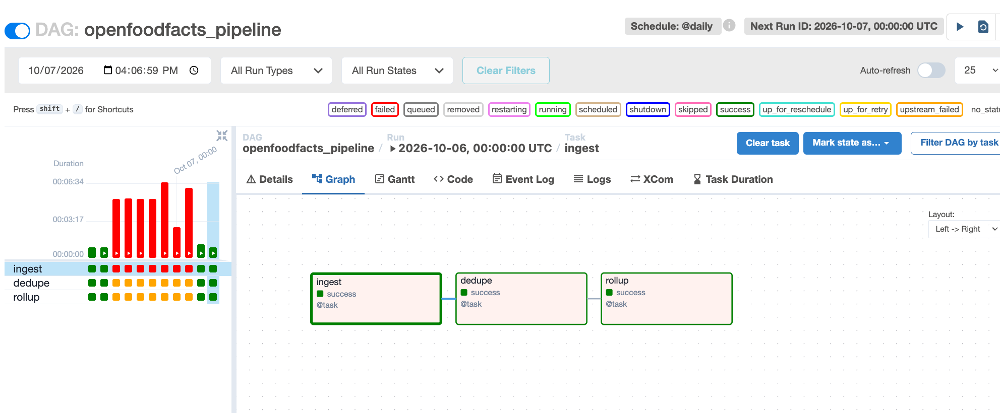
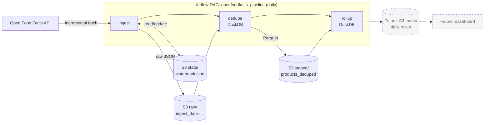

# OpenFoodFacts Incremental Data Pipeline

An incremental data pipeline that ingests snack product data from the [Open Food Facts](https://world.openfoodfacts.org) API into S3, deduplicates it with DuckDB, and rolls it up into a daily summary. The flow is orchestrated by Airflow and runs locally with Docker Compose.




## What it does

1. **ingest**: fetches products changed since the last run (watermark on `last_modified_t`) and writes raw JSON batches to S3.
2. **dedupe**: DuckDB reads every raw batch straight from S3 and keeps the latest version of each product, writing one Parquet file back to S3.
3. **rollup**: DuckDB reads the staged Parquet and counts products modified per day (UTC).

Tasks never share memory. They hand off through S3, and Airflow passes only the staged file path between them.

## Architecture



Dashed boxes are planned, not built. The full reasoning, including alternatives considered and findings from live runs, is in [design document](docs/design.md).

## Tech stack

Python 3.12+, [uv](https://docs.astral.sh/uv/), requests, tenacity, boto3, DuckDB, Airflow 2.10, Docker Compose, pytest, AWS S3.

## Prerequisites

- Python 3.12 or newer
- [uv](https://docs.astral.sh/uv/getting-started/installation/)
- Docker and Docker Compose (for the Airflow setup)
- An AWS account, an S3 bucket, and credentials configured locally (`aws configure`). The credentials need `s3:GetObject`, `s3:PutObject` and `s3:ListBucket` on the bucket.

## Setup

```bash
git clone https://github.com/lemuelhmgs12/openfoodfacts-data-pipeline.git
cd openfoodfacts-data-pipeline
uv sync
cp .env.example .env
```

Edit `.env` and set your bucket name:

```
S3_BUCKET=your-bucket-name
```


## Run the pipeline without Airflow

```bash
uv run ingest
```

This runs the ingest step only: it reads the watermark from S3, fetches new products, writes raw batches, and advances the watermark once everything has been written.

## Run with Airflow

From the `airflow/` folder:

```bash
cd airflow
cp .env.example .env     # set AIRFLOW_UID and S3_BUCKET
docker compose build
docker compose up airflow-init
docker compose up -d
```

Then open <http://localhost:8080> and sign in with the default local credentials (`airflow` / `airflow`). Find `openfoodfacts_pipeline`, unpause it, and trigger a run with the play button. The Graph view shows the three tasks.

To stop everything: `docker compose down`.

Notes:

- **AWS credentials**: the compose file mounts your `~/.aws` folder into the containers read-only. This is for local development only. In production, tasks would get credentials from an IAM role instead.
- **Rebuilding**: the pipeline package is baked into the Airflow image. After changing anything under `src/`, run `docker compose build` and `docker compose up -d`. Changes to files in `airflow/dags/` apply automatically within about 30 seconds.


## Run with Docker (single container)

```bash
docker build -t openfoodfacts-ingest .
docker run --rm --env-file .env -v ~/.aws:/root/.aws:ro openfoodfacts-ingest
```


## Run the tests

```bash
uv run pytest
```

The tests cover the API client (retries, status handling), the watermark logic, storage writes, and the orchestrator, using mocked HTTP and a fake S3 client. No network or AWS access is needed.

## Project layout

```
.
├── src/pipeline/
│   ├── config.py          # Settings dataclass
│   ├── api_client.py      # Open Food Facts client with retries
│   ├── watermark.py       # Read/write the incremental watermark in S3
│   ├── storage.py         # Write raw batches to S3
│   ├── orchestrator.py    # One full ingest run
│   ├── cli.py             # `ingest` command
│   └── sql/
│       ├── connection.py  # DuckDB connection with S3 access
│       ├── runner.py      # Runs a .sql file with named placeholders
│       └── queries/       # stage_deduped_products.sql, rollup_products.sql
├── airflow/
│   ├── docker-compose.yaml
│   ├── Dockerfile         # Airflow image with the pipeline package installed
│   ├── dags/              # openfoodfacts_dag.py
│   └── .env.example
├── tests/
├── scripts/               # ad hoc exploration, not part of the package
└── docs/design.md         # design decisions and findings
```

## Design decisions and known limitations

- **Incremental by watermark.** Results are fetched newest-first and paging stops at the previous watermark. The boundary is inclusive, so the raw zone is at-least-once and the dedupe step removes repeats.
- **Fail loudly.** If retries are exhausted the run fails, the watermark does not advance, and it is safe to rerun.
- **Idempotent staging.** The staged Parquet is rebuilt in full from raw and written to a fixed key, so retries produce the same file.
- **UTC dates.** Daily rollups are cut in UTC so results do not depend on where the query runs.
- **Not built yet.** The rollup currently logs its result. Persisting it to S3 and building a dashboard on top are next. Alerting on failed runs is also still to do.