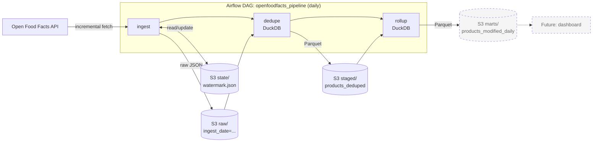

# Design Document: OpenFoodFacts Ingestion Pipeline

## 1. Problem Statement
Retailers and product-catalog teams need visibility into how their product data changes over time — new items added, pricing/ingredient updates, category shifts — without re-processing an entire catalog on every run. This project builds a small-scale, production-style incremental data pipeline that ingests snack product data from the Open Food Facts API, lands it in a raw data lake (S3), and tracks changes over time using a watermark-based incremental extraction pattern. The goal is to demonstrate core data engineering competencies — API integration, incremental ETL design, cloud storage, orchestration, and data quality — on a real dataset.

## 2. Data Source
- API: Open Food Facts (world.openfoodfacts.org)
- Scope: "snacks" category
- Access: No auth required; requires custom User-Agent header
- Known constraints: 
    - intermittent 503s observed during development (needs retry logic)
    - maximum 100 products per page (larger requested sizes are silently capped)
    - pages above 10 are refused with a 401, so at most 1,000 products are reachable per query (see section 9)

## 3. Alternatives Considered
**Data source**
- Best Buy API — rejected: blocked free/edu email signups
- eBay API — rejected: developer application denied
- Open Food Facts — selected: no signup friction, real incremental field (last_modified_t)

**Transform / warehouse layer**
- Glue/Spark + Redshift/Athena — rejected: far more infrastructure than a few thousand rows justify
- DuckDB reading S3 directly — selected: no cluster to run, plain SQL files, reads JSON and Parquet from S3

## 4. Architecture

**Note on this diagram's evolution**: originally planned as
Glue/Spark → Redshift/Athena → dbt, matching a typical enterprise
stack. In practice, DuckDB querying S3 directly replaced the separate
transform-layer + warehouse-service split entirely -- no Spark cluster
or managed warehouse needed at this data volume, and DuckDB's native
S3 support meant no ETL step to load data into a warehouse before
querying it. dbt is deferred: two models don't justify the extra
tooling, but if it is adopted later it would run directly against
DuckDB rather than against Redshift/Athena.

**How the pieces fit**: Airflow moves control; S3 holds the data. Each
task runs as its own process (possibly on a different worker), so tasks
never share memory. They hand off through S3, and Airflow passes only
small values such as the staged file path.
 
The `rollup` task reads the staged Parquet, counts products modified per
day (UTC), and writes the result to a marts layer in S3. It also logs
the result of the write and returns the marts path. The marts file is
what a future dashboard would read.

## 5. Incremental Strategy
- Watermark on `last_modified_t`, stored as JSON in S3 (s3://bucket/state/watermark.json)
- Results are requested newest-first, so paging stops once a product at or older than the watermark is reached
- The boundary comparison is `>=`: products exactly at the watermark are fetched again. The raw zone is therefore at-least-once, and duplicates are removed downstream by the dedupe step
- Watermark updated only after successful write of every batch (avoid data loss on partial failure)
- Limitation: because of the 10-page ceiling, a run can reach at most 1,000 products. If more than that changed since the last watermark, older changes are not fetched (see sections 8 and 9)

## 6. Storage Layout
- Raw: s3://bucket/raw/openfoodfacts/ingest_date=YYYY-MM-DD/batch_{run_time}_{count}.json (the run time in the name keeps separate runs on the same day from overwriting each other)
- State: s3://bucket/state/watermark.json
- Staged: s3://bucket/staged/openfoodfacts/products_deduped.parquet — one row per product, written to a fixed key so reruns overwrite instead of accumulate
- Marts: s3://bucket/marts/openfoodfacts/products_modified_daily.parquet — one row per UTC day with the number of products modified that day, rebuilt in full from staged on every run and written to a fixed key

## 7. Error Handling
- Retry with exponential backoff on 503 (tenacity, max 3 attempts)
- **503 failure rate measured empirically at ~60%** (see Findings Log) —
  high enough that retry is load-bearing, not a nice-to-have
- **Retry-exhaustion behavior**: fail the run loudly (non-zero exit,
  watermark NOT advanced — safe to simply re-run) AND trigger an alert.
  Silent skip was rejected: at a 60% base failure rate, silently
  skipping would lose data almost every run.
- **Not yet implemented**: the alerting mechanism itself (candidates:
  SNS topic + email/Slack, or a simple webhook). Tracked in section 8.

## 8. Open Questions / Future Work
- Warn (or fail) when the page cap ends a run before the watermark is reached, so a gap is visible instead of silent
- Investigate whether the API supports filtering by modification time, which would allow walking forward in slices small enough to fit the 1,000-result limit
- Persist the rollup to S3 (marts layer) and build a dashboard on it
- Terraform for infra-as-code?
- Monitoring/alerting approach
- Alerting mechanism for failed runs (SNS? Slack webhook?) — decision
  made in section 7, implementation still pending
- Production credentials: use IAM roles (task role or IRSA) instead of the `~/.aws` mount used for local development
- Resolved: the "pagination limit per run" question — capped at 10 pages, the most the API serves (see section 9)
- Resolved (likely): the earlier mid-retry 401 — probably the same page-number ceiling, since the later Airflow failures were reproducible 401s at page 11. 

## 9. Findings Log
- **Endpoint choice**: switched from `/cgi/search.pl` to `/api/v2/search`.
  OFF's own docs mark the legacy `search.pl` endpoint as "not recommended
  for new integrations" in favor of the v2 structured search API, which
  supports `categories_tags`, `sort_by`, `fields`, and documented pagination.
- **Sort order verified empirically**: `sort_by=last_modified_t` on
  `/api/v2/search` returns results **newest-first (descending)**. This
  was not documented explicitly, so it was confirmed by requesting page 1
  and checking that timestamps were in descending order (see
  `verify_sort_order.py`). This is what makes early-stop pagination for
  the incremental strategy (section 5) valid — without it, we'd have to
  page through the entire catalog on every run.

- **Real page size cap discovered**: `page_size` was set to 1000 in
  Settings, but the API silently caps actual results at 100 products
  per page regardless of what's requested — confirmed via a diagnostic
  log counting products per page in production. This meant batches
  (batch_size=500) rarely triggered, since 5 consecutive successful
  pages were needed before a single write, against a ~60% per-page
  failure rate. Fixed by aligning page_size to the real ceiling (100)
  and lowering batch_size to 300, so a batch completes within 3 pages
  instead of 5.

- **Same-day run collision found in manual testing**: batch filenames were
  built from ingest_date + a per-run batch counter starting at 0, with
  no identifier distinguishing separate runs on the same day. Running
  the pipeline multiple times in one day caused later runs to silently
  overwrite earlier runs' batch_000.json, batch_001.json, etc. — found
  by manually inspecting S3 and noticing files being replaced rather
  than accumulating. Fixed by generating one timestamp per run() call
  (HH-MM-SS) and adding it into the filename
  (batch_{run_time}_{count}.json).

- **Live 401 observed mid-retry (open question)**: during a run with
  many consecutive 503s, one retry attempt returned 401 Unauthorized
  instead. OFF's docs state no auth is required for this endpoint, and
  no credentials are ever sent. Currently
  handled correctly as a non-retryable OpenFoodFactsError (any 4xx),
  which is the right behavior regardless of root cause.

- **End-to-end validation against live data**: confirmed, via multiple
  real runs against production OpenFoodFacts + a real S3 bucket, that
  (1) a full successful run correctly writes all batches and only then
  advances the watermark, (2) a run that crashes partway through
  correctly leaves the watermark untouched. Verified directly in S3,
  not just in tests, (3) a subsequent run against an already-current
  watermark correctly early-stops after a single page, confirming the
  incremental strategy's efficiency payoff in practice, not just in
  design.

  - **Page-number ceiling (401)**: runs under Airflow kept failing after
  page 10 with a 401, even though the 503s on earlier pages were
  recovering through retries. Direct requests showed page 11 returns 401
  at `page_size=100` and also at `page_size=20` (only 220 products in),
  so the limit is on page number, not result count. At 100 products per
  page the most reachable is 1,000 products per query. Decision: cap
  `max_page_per_run` at 10 and accept the gap for now, with a warning
  still to be added (section 8).
- **Idempotent staging**: the staged Parquet is written to a fixed key
  and rebuilt in full from raw, so an Airflow retry produces the same
  file. Verified: staged row count matched the count of distinct product
  codes in raw.
- **UTC for daily rollups**: the same data gave different daily counts
  depending on whether dates were cut in local time or UTC, because
  `to_timestamp(...)::DATE` uses the session time zone (Los Angeles
  locally, UTC in the container). Rollups convert explicitly to UTC so
  results do not depend on where the query runs.
- **Image vs DAG file**: the pipeline package is baked into the Airflow
  image, so changes under `src/` need `docker compose build` and
  `up -d`. The DAG file is mounted, so DAG changes apply within about
  30 seconds.
- **Containers have no access to host credentials**: local development
  mounts `~/.aws` read-only and passes `S3_BUCKET` through the ignored
  `airflow/.env`. This is for local use only; production would use an
  IAM role.
 