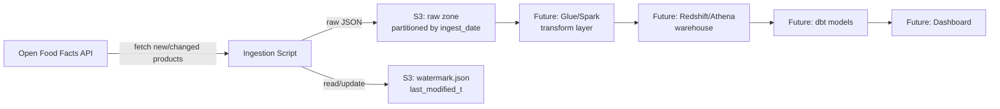

# Design Document: OpenFoodFacts Ingestion Pipeline

## 1. Problem Statement
Retailers and product-catalog teams need visibility into how their product data changes over time — new items added, pricing/ingredient updates, category shifts — without re-processing an entire catalog on every run. This project builds a small-scale, production-style incremental data pipeline that ingests snack product data from the Open Food Facts API, lands it in a raw data lake (S3), and tracks changes over time using a watermark-based incremental extraction pattern. The goal is to demonstrate core data engineering competencies — API integration, incremental ETL design, cloud storage, orchestration, and data quality — on a real dataset.

## 2. Data Source
- API: Open Food Facts (world.openfoodfacts.org)
- Scope: "snacks" category
- Access: No auth required; requires custom User-Agent header
- Known constraints: intermittent 503s observed during development (needs retry logic)

## 3. Alternatives Considered
- Best Buy API — rejected: blocked free/edu email signups
- eBay API — rejected: developer application denied
- Open Food Facts — selected: no signup friction, real incremental field (last_modified_t)

## 4. Architecture

## 5. Incremental Strategy
- Watermark on `last_modified_t`, stored as JSON in S3 (s3://bucket/state/watermark.json)
- Each run: fetch records where last_modified_t > watermark
- Watermark updated only after successful write (avoid data loss on partial failure)

## 6. Storage Layout
s3://bucket/raw/openfoodfacts/ingest_date=YYYY-MM-DD/batch_NNN.json

## 7. Error Handling
- Retry with exponential backoff on 503 (tenacity, max 3 attempts)
- **503 failure rate measured empirically at ~60%** (see Findings Log) —
  high enough that retry is load-bearing, not a nice-to-have
- **Retry-exhaustion behavior**: fail the run loudly (non-zero exit,
  watermark NOT advanced — safe to simply re-run) AND trigger an alert.
  Silent skip was rejected: at a 60% base failure rate, silently
  skipping would lose data almost every run.
- **Not yet implemented**: the alerting mechanism itself (candidates:
  SNS topic + email/Slack, or a simple webhook). Tracked in section 8.

## 8. Open Questions / Future Work
- Pagination limit per run (287K total products — need a sane cap)
- Terraform for infra-as-code?
- Monitoring/alerting approach
- Alerting mechanism for failed runs (SNS? Slack webhook?) — decision
  made in section 7, implementation still pending
- Investigate the 401 observed mid-retry: reproduce under rapid manual
  requests (curl/Postman in quick succession) to test whether it's
  rate-limiting-related; consider whether 401 should be added to the
  retryable set if confirmed

## 9. Findings Log
- **Endpoint choice**: switched from `/cgi/search.pl` to `/api/v2/search`.
  OFF's own docs mark the legacy `search.pl` endpoint as "not recommended
  for new integrations" in favor of the v2 structured search API, which
  supports `categories_tags`, `sort_by`, `fields`, and documented pagination.
- **Sort order verified empirically**: `sort_by=last_modified_t` on
  `/api/v2/search` returns results **newest-first (descending)**. This
  was not documented explicitly, so it was confirmed by requesting page 1
  and checking that timestamps were in descending order (see
  `verify_sort_order.py`). This is what makes early-stop pagination for
  the incremental strategy (section 5) valid — without it, we'd have to
  page through the entire catalog on every run.

- **Real page size cap discovered**: `page_size` was set to 1000 in
  Settings, but the API silently caps actual results at 100 products
  per page regardless of what's requested — confirmed via a diagnostic
  log counting products per page in production. This meant batches
  (batch_size=500) rarely triggered, since 5 consecutive successful
  pages were needed before a single write, against a ~60% per-page
  failure rate. Fixed by aligning page_size to the real ceiling (100)
  and lowering batch_size to 300, so a batch completes within 3 pages
  instead of 5.

- **Same-day run collision found in manual testing**: batch filenames were
  built from ingest_date + a per-run batch counter starting at 0, with
  no identifier distinguishing separate runs on the same day. Running
  the pipeline multiple times in one day caused later runs to silently
  overwrite earlier runs' batch_000.json, batch_001.json, etc. — found
  by manually inspecting S3 and noticing files being replaced rather
  than accumulating. Fixed by generating one timestamp per run() call
  (HH-MM-SS) and adding it into the filename
  (batch_{run_time}_{count}.json).

- **Live 401 observed mid-retry (open question)**: during a run with
  many consecutive 503s, one retry attempt returned 401 Unauthorized
  instead. OFF's docs state no auth is required for this endpoint, and
  no credentials are ever sent. Currently
  handled correctly as a non-retryable OpenFoodFactsError (any 4xx),
  which is the right behavior regardless of root cause.

- **End-to-end validation against live data**: confirmed, via multiple
  real runs against production OpenFoodFacts + a real S3 bucket, that
  (1) a full successful run correctly writes all batches and only then
  advances the watermark, (2) a run that crashes partway through
  correctly leaves the watermark untouched. Verified directly in S3,
  not just in tests, (3) a subsequent run against an already-current
  watermark correctly early-stops after a single page, confirming the
  incremental strategy's efficiency payoff in practice, not just in
  design.